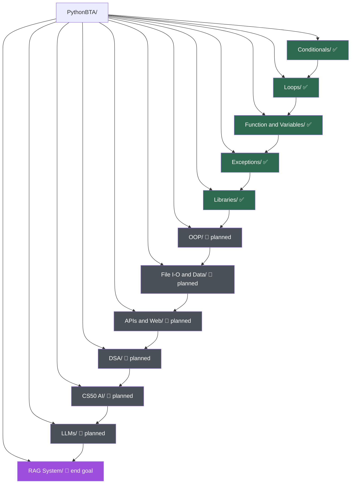

# PythonBTA
# PythonBTA

**Basic to Advance** — a single, growing repository documenting my Python journey from `print("Hello, World")` to building a working RAG (Retrieval-Augmented Generation) system.

This isn't a course archive. It's a personal record of everything I write in Python, organized by concept, kept in one place so progress is visible and nothing gets lost across scattered folders.

---

## Why This Repo Exists

Most learning code ends up buried in random folders, half-finished repls, or deleted entirely once a course is "done." PythonBTA is my attempt to avoid that — every concept, from fundamentals to advanced systems, lives here in one continuous timeline. It's meant to be readable by me a year from now, and by anyone else checking how I actually learn and build.

---

## Progress Roadmap

- [x] **Basics** — variables, conditionals, loops, functions
- [x] **Exceptions** — error handling, custom exceptions, EAFP
- [x] **Libraries** — working with external packages, command-line arguments
- [ ] **Object-Oriented Programming**
- [ ] **File I/O & Data Handling** (CSV, JSON, SQLite)
- [ ] **APIs & Web Requests**
- [ ] **Web Development** (Flask/FastAPI basics)
- [ ] **Data Structures & Algorithms** (applied, not just theory)
- [ ] **CS50 AI with Python** — search, knowledge, uncertainty, optimization, machine learning, neural networks, natural language
- [ ] **Working with LLMs** (prompting, API calls, embeddings)
- [ ] **Building a RAG System** (the current end goal)

This list will keep expanding as the repo grows — check back for updates rather than expecting a fixed scope.

---

## Architecture



Green = completed, grey = planned, purple = the end goal. The diagram doubles as the folder tree and the learning path — each box down the chain is a prerequisite for the one after it.

---

## Repository Structure

| Folder | What's Inside |
|---|---|
| `Conditionals/` | Practice scripts on if/elif/else and match-case |
| `Loops/` | For loops, while loops, loop control |
| `Function and Variables/` | Function definitions, scope, arguments |
| `Exceptions/` | try/except/else/finally, custom exceptions, and a full cheat sheet |
| `Libraries/` | Working with external libraries and command-line arguments |

Each folder contains standalone `.py` scripts, and where relevant, a short README or notes explaining the concept in plain language — not just the code.

---

## How to Use This Repo

Every script is self-contained — clone the repo and run any file directly:

```bash
git clone https://github.com/rautroshan-sys/PythonBTA.git
cd PythonBTA
python3 <folder_name>/<script_name>.py
```

No special setup is required for the basics; folders involving external libraries will include their own install instructions once added.

---

## About Me

19-year-old CS student learning Python from the ground up, with the long-term goal of working in AI/LLM engineering. This repo is where the fundamentals get built — properly, not just copy-pasted.


---

## A Note on Progress

This repo will look sparse today and dense in a few months. That gap is the point — it's meant to be a visible, honest record of the climb from basics to building real AI systems, not a polished final product from day one.